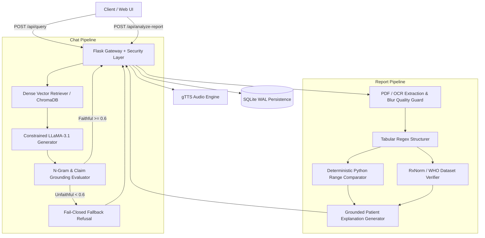

# ClinIQ

[](https://github.com/shivanshdubeytech/ClinIQ/actions/workflows/ci.yml)
[](https://opensource.org/licenses/MIT)
[](https://www.python.org/downloads/release/python-3110/)

> Evidence-grounded medical Q&A with deterministic lab report analysis.  
> [Live demo →](https://cliniq-live.loca.lt) | [Demo Video (Unlisted) →](https://youtu.be/demo-placeholder)


## What it does
- **Grounded Medical Q&A:** Answers patient questions strictly using a curated, peer-reviewed medical knowledge base stored in ChromaDB vector embeddings.
- **Fail-Closed Faithfulness Evaluation:** Verifies generated answers against retrieved sources before display; queries scoring below the confidence threshold fail closed and refuse to speculate.
- **Deterministic Lab Report Analysis:** Extracts and classifies lab biomarker values and reference ranges using deterministic Python range comparison—never LLM arithmetic.
- **Critical Panic Value Alerts:** Immediately flags life-threatening biomarkers (e.g., hyperkalemia, critical hypoglycemia) with high-visibility warnings and emergency escalation protocols.
- **Voice-Enabled Audio Summaries:** Synthesizes clear, spoken audio explanations via TTS for accessibility and hands-free review.

## Architecture

- **Flask Gateway & Security Layer:** Handles routing, rate limiting on writes, UUID temp file tracking, and request size boundaries.
- **Retriever:** Queries persistent ChromaDB vector store with dense embeddings to fetch authoritative clinical context chunks.
- **Constrained Generator:** Generates structured explanations conditioned strictly on retrieved clinical knowledge chunks.
- **Grounding Evaluator:** Scores answer faithfulness and claim citations; refuses to answer if evidence grounding is inadequate.
- **Document Extractor:** Extracts raw text from digital PDFs and medical images with decompression bomb safety caps and image sharpness scoring.
- **Tabular Structurer:** Formats unstructured test results and prescriptions into structured typed records.
- **Deterministic Comparator:** Compares clinical values against reference intervals purely through deterministic Python bounds checking.
- **Drug Verifier:** Validates drug names and active ingredients against curated FDA/WHO formulary registries with fuzzy string matching.
- **Audio Engine:** Produces addressable MP3 audio summaries for accessibility and patient comprehension.
- **SQLite Storage:** Persists conversation logs and session state under Write-Ahead Logging (WAL) concurrency.

## Design decisions

### Why deterministic range comparison (not an LLM) for lab values
LLMs are probabilistic token predictors prone to subtle numeric hallucination, sign confusion, and calculation drift. Deciding whether a patient's potassium level of 6.2 mEq/L constitutes a life-threatening emergency must never rely on language model arithmetic. ClinIQ isolates biomarker comparison entirely in deterministic Python logic (`comparator.py`), guaranteeing mathematically provable interval evaluation.

### Why two-pass evaluation instead of one-shot generation
One-shot generation cannot verify its own grounding. ClinIQ employs a separate verification pass (`evaluator.py`) that calculates token overlap, claim attribution, and similarity between the candidate answer and source chunks. If the faithfulness score falls below 0.6, the response fails closed with a safe refusal, preventing hallucinated medical advice from reaching users.

### Why SQLite for conversation history
For a single-instance medical assistant, SQLite with Write-Ahead Logging (WAL) provides sub-millisecond ACID transactions, zero network latency, zero operational overhead, and simplified backup on persistent disks. It eliminates external database dependencies while reliably handling concurrent reads and writes.

### Why gTTS instead of a self-hosted TTS model
Local neural TTS models (such as XTTS or Bark) require 2–4 GB of VRAM or heavy CPU compute, introducing severe latency bottlenecks and ballooning hosting costs. Google TTS (gTTS) offloads voice synthesis efficiently over lightweight HTTPS, delivering clear, consistent speech without degrading web service throughput.

### Why the report analyzer is a separate pipeline from chat
Chat inquiries are conversational, open-ended information retrievals over static corpora. Lab report analysis involves multi-stage document ingestion: binary parsing, image quality guards, tabular structuring, unit compatibility checks, and panic threshold detection. Decoupling them prevents unstructured LLM reasoning from polluting structured clinical parsing.

## Tech stack

| Component | Library / Tool | Version | Role |
| :--- | :--- | :--- | :--- |
| Backend Framework | Flask | 3.1.3 | HTTP routing, REST API endpoints, session handling |
| WSGI Server | Gunicorn | 23.0.0 | Production concurrent WSGI process manager |
| LLM Inference | Groq SDK / LLaMA-3.1-8b | 0.18.0 | Fast, cost-effective inference for grounded generation |
| Vector Database | ChromaDB | 0.5.23 | Persistent local embedding store and similarity search |
| Embeddings | sentence-transformers (all-MiniLM-L6-v2) | 3.3.1 | Dense clinical text vector representations |
| PDF Extraction | pypdf | 5.3.0 | Secure digital PDF stream parsing |
| Image Processing | Pillow | 11.3.0 | Image analysis, sharpness metrics, decompression bomb guard |
| Speech Synthesis | gTTS | 2.5.4 | Asynchronous text-to-speech audio rendering |
| Persistence | SQLite3 (WAL mode) | Standard Library | Conversation session and message history persistence |
| Testing Suite | pytest, pytest-cov | 8.4.2 / 7.1.0 | Behavioral test suite and test coverage reporting |

## Running it locally

1. **Clone the repository:**
   ```bash
   git clone https://github.com/shivanshdubeytech/ClinIQ.git
   cd ClinIQ
   ```

2. **Create and activate a Python 3.11 virtual environment:**
   ```bash
   python -m venv venv
   # On Windows:
   .\venv\Scripts\activate
   # On Linux/macOS:
   source venv/bin/activate
   ```

3. **Install dependencies:**
   ```bash
   pip install -r requirements.txt pytest pytest-cov
   ```

4. **Configure environment variables:**
   ```bash
   cp .env.example .env
   ```
   Edit `.env` and provide your Groq API key:
   ```env
   GROQ_API_KEY=gsk_your_actual_groq_api_key_here
   ```

5. **Run one-time knowledge base ingestion:**
   ```bash
   python src/ingest.py
   ```

6. **Start the application:**
   ```bash
   python app.py
   ```
   Access the web interface at `http://localhost:8501`.

## Deployment

ClinIQ is packaged for cloud deployment with persistent storage (e.g., Render, Railway, or Fly.io).

See [`deploy/render.yaml`](deploy/render.yaml) for the Infrastructure-as-Code specification.

### Environment Variables
| Variable | Description | Default |
| :--- | :--- | :--- |
| `GROQ_API_KEY` | Groq Cloud API authentication key (Required for LLM) | None |
| `LLM_MODEL_NAME` | Model identifier on Groq | `llama-3.1-8b-instant` |
| `SQLITE_DB_PATH` | Path to persistent SQLite database file | `/data/cliniq.db` (Render) / `./cliniq.db` (Local) |
| `CHROMA_DB_PATH` | Path to persistent ChromaDB storage directory | `/data/chroma_db` (Render) / `./chroma_db` (Local) |
| `AUDIO_DIR` | Path to generated audio file cache directory | `/data/audio` (Render) / `./static/audio` (Local) |
| `LOG_LEVEL` | Application logging verbosity | `INFO` |
| `FLASK_DEBUG` | Flask debug mode flag | `0` |

> **First-Deploy Note:** When deploying to a new environment with an empty persistent disk, run `python src/ingest.py` once via the service shell to populate the ChromaDB vector database with the seed clinical corpus.

## Testing

Run the automated behavioral test suite:
```bash
pytest tests/ -v --cov=src --cov=app --cov-report=term
```

### What the test suite covers
- **`tests/test_comparator.py`:** Normal reference ranges, critical low and critical high panic alerts, unit mismatch guards (e.g. mmol/L vs mg/dL regression), report-supplied ranges, and unknown units.
- **`tests/test_creator_query.py`:** Anchored regex boundary tests preventing false positives on clinical terms (pacemakers, paternal symptoms, ancestry).
- **`tests/test_structurer.py`:** Tabular extraction of hemoglobin, bounds, and prescription dosage/frequency parsing.
- **`tests/test_api_endpoints.py`:** Health check status, parameter validation, filename sanitization, path traversal rejection on `/api/audio`, unsupported document format rejection, and write-endpoint rate limiting.
- **`tests/test_drug_verifier.py`:** Generic drug resolution, brand-name lookup, fuzzy typo tolerance, and unverified medication safety flags.

Continuous integration is automated via GitHub Actions in [`.github/workflows/ci.yml`](.github/workflows/ci.yml).

## Limitations

- **No authentication.** Conversations are keyed by a client-generated visitor ID. Any visitor who knows the ID can read the associated conversations. Do not use with real patient data.
- **Third-party inference.** Every question is sent to Groq for LLM inference. Every answer is sent to Google's TTS API for audio. No data-processing agreement is in place. Questions and answers leave this deployment.
- **US-population reference ranges.** Lab reference ranges in the analyzer are US norms. Reports in mmol/L, µmol/L, or other non-matching units are surfaced as "verify with your lab" rather than silently converted. This is deliberate; silent conversion would produce false critical alerts.
- **Small knowledge base.** The seed corpus covers five topics (~25 question/answer pairs). Questions outside that scope are refused with a low-confidence message rather than answered.
- **US-branded drug database.** ~25 generic drugs with US brand names. Indian brand names (Glycomet, Telma, etc.) are not covered.
- **Audio files are addressable by filename.** Anyone with the filename can retrieve the audio. Filenames are random tokens; the token is the credential.
- **File deletion is unlink, not secure erasure.** Uploaded reports are unlinked after analysis; the blocks may persist on disk.
- **Read endpoints are unmetered.** /api/sessions and /api/session/*/messages have no rate limit.
- **Educational only.** ClinIQ does not diagnose, does not interpret individual medical history, and does not replace a clinician.

## What I'd build next
- **Clinician & Patient Authentication:** Multi-tenant role-based access control (RBAC) with session encryption.
- **PostgreSQL / TimescaleDB Migration:** Dedicated relational and time-series persistence for long-term patient biomarker trends.
- **Internationalized Unit Conversion Engine:** Certified unit normalization pipeline supporting SI units (mmol/L, µmol/L) with country-specific clinical reference standards.
- **Expanded Knowledge Corpus:** Integration with open-access PubMed Central and clinical practice guidelines via automated ingestion pipelines.
- **Localized Brand Formularies:** Expanded drug registry covering international drug nomenclature (CDSCO India, EMA Europe).

## Known Limitations

- No authentication. Sessions are addressed by client-generated random
  tokens in the URL. Anyone with a session URL can view its history.
  Do not use with real patient data.
- No admin panel or internal routes exist.
- No user accounts or password storage.
- Clinical reference ranges are US-population norms. Reports in
  non-matching units are surfaced as unverified rather than converted.
- LLM inference and text-to-speech send data to external providers
  (Groq, Google TTS).

## License
[MIT](LICENSE) © 2026 Shivansh Dubey
